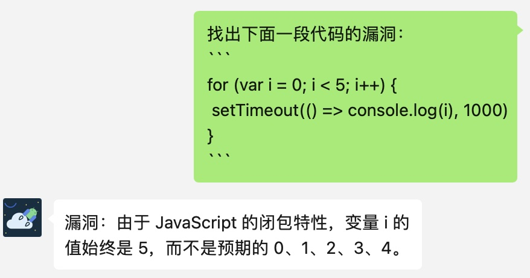

## 免注册免费使用 ChatGPT

请关注微信公众号【胖竹同学】

### 使用方法

直接在聊天框中输入提问即可。

**如果你觉得好用，请给个 star 吧~~~**

## 关于胖竹同学

最近试用 AI 的代表 ChatGPT 一段时间了，越来越感觉 AI 很强大，是强大的生产力工具且极具潜力，能充分用好 AI 这个强生成力工具，将大大提升自己的竞争力。

但是，由于一些众所周知的限制，在国内使用不便，这也让 AI 离大家还有些距离。

胖竹同学希望人人都能便捷地用好 AI，将 AI 能力为己所用。胖竹同学已经完成了 ChatGPT 聊天集成，接下来计划集成更多特性，让人人都能便捷地用上 AI 能力。

* 【DONE】集成ChatGPT聊天功能，便捷地和ChatGPT对话
* 【PEND】集成ChatGPT其他特性，如图片分析、语音翻译等等

以上就是胖竹同学的一些想法和计划，寻找志同道合的同学一起实现。如果大家有什么想法或建议，欢迎大家加入交流群：

或者可以在 Discussions 里讨论，也可以通过邮件 icanner@hotmail.com 私信，一起交流，一起促进 AI 发展。

最后，如果你觉得【胖竹同学】对你有帮助，请多多支持胖竹同学，让胖竹同学持续运营下去~~~

| 微信                                            | 支付宝                                            |
|-----------------------------------------------|------------------------------------------------|
|  |  |
